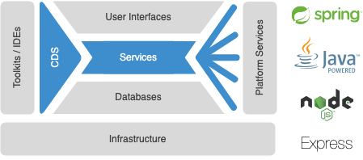
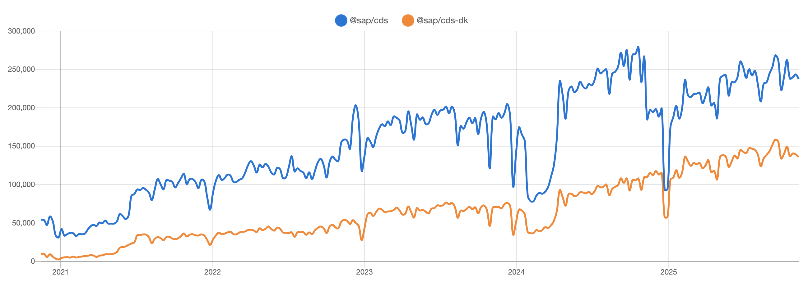

<!-- _paginate: false -->
<!-- _footer: '' -->

#### SAP Cloud Application Programming Model heute und morgen

Gregor Wolf
SAP Solution Architekt und Entwickler

---

## Was ist CAP?

Aus Capire der CAP Dokumentation (https://cap.cloud.sap/):

Das SAP Cloud Application Programming Model (CAP) ist ein Framework von Sprachen, Bibliotheken und Werkzeugen für die Entwicklung von Services und Anwendungen in Unternehmensqualität. Es führt Entwickler auf einen "goldenen Pfad" mit bewährten Best Practices und einer Fülle von Standardlösungen für wiederkehrende Aufgaben.

---

## CAP Architektur

---

## CAP heute

- Breite Verwendung bei SAP, Partnern und Kunden
- SAP: Viel CAP Java
- Partnern und Kunden: Eher CAP Node.JS
- Bei Partnern für Multitenant Anwendungen
- Wachsende Anzahl an [Plugins](https://cap.cloud.sap/docs/plugins/)
- Unterstützung für SAP RFC

---

## CAP NPM Download Statistik

Quelle: [https://npmtrends.com/@sap/cds-vs-@sap/cds-dk](https://npmtrends.com/@sap/cds-vs-@sap/cds-dk)

---

## CAP Anwendungsbeispiele

- Middleware zwischen AI Erkennung von Kundenaufträgen und SAP ERP
- Bestandsdatenkonsolidierung von unterschiedlichsten ERP Systemen (SAP ERP, SAP ByDesign, Navision) für einen Webshop
- Verschalung von 28 S/4HANA Public Cloud OData APIs mit Datenreplikation und -filterung für einen Carve Out

---

## CAP morgen

- AI unterstützte Entwicklung insbesondere durch [CAP MCP Server](https://github.com/cap-js/mcp-server)
- Unterstützung für SAP BDC Data Products
- Spekulation: Revival von HANA XSA mit CAP durch die Investitionen von SAP für SAP Forms Service by Adobe

---

## Kontakt

**Gregor Wolf**, [Computerservice Wolf](https://computerservice-wolf.com/)
[gregor@computerservice-wolf.com](mailto:gregor@computerservice-wolf.com)
[@gregorw@chaos.social](https://chaos.social/@gregorw)
[https://github.com/gregorwolf](https://github.com/gregorwolf)

